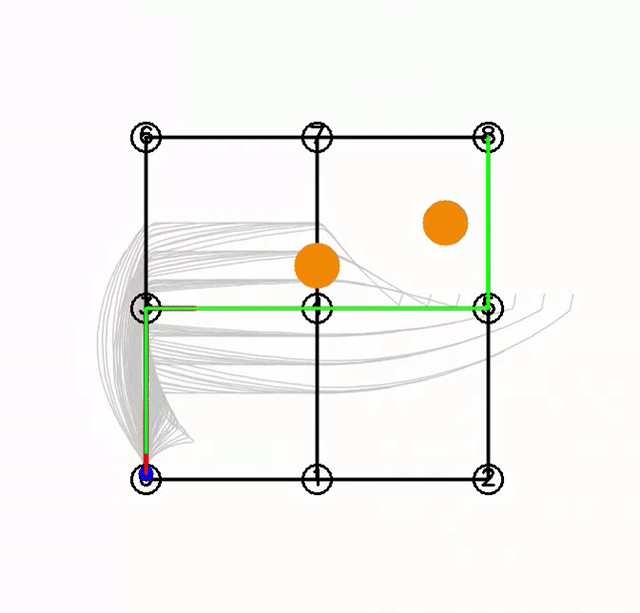

# av-motion-planner

A layered **autonomous-vehicle motion-planning stack** in modern C++ (C++23), with
2D OpenCV visualization. A simulated car plans a global route, generates smooth
local trajectories in the **Frenet frame**, scores them, avoids obstacles, and drives
itself to the goal. Three-layer architecture: global → behavioral → local.



*The car follows the A\* route, swerves around obstacles, and stops near the goal.
Blue = the car; green = the A\* route; orange = obstacles; gray fan = candidate
trajectories; bold red = the chosen collision-free trajectory.*

---

## What it does

Each frame, the planner:

1. **Global route** - A\* searches a road graph for a path from start to goal.
2. **Reference line** - the jagged A\* path becomes a smooth centerline with arc
   length and heading at every point.
3. **Candidate generation** - dozens of smooth trajectories are sampled in the Frenet
   frame by sweeping lateral offset × time horizon × target speed, each drawn by a
   **quintic** (lateral) and **quartic** (longitudinal) polynomial.
4. **Scoring** - every candidate gets a cost (jerk, lane-center deviation, speed
   error, obstacle proximity); the cheapest **collision-free** one wins.
5. **Behavior** - a small feasibility-based state machine: **CRUISE** when a safe path
   exists, **STOP** when the road is blocked or the goal is reached.
6. **Control** - pure-pursuit steering + proportional speed control execute the chosen
   trajectory on a kinematic bicycle model.

...then it re-plans from the car's new state once per rendered frame (the loop is
paced by `cv::waitKey(30)`, a ~30 ms delay, so roughly 30 frames per second).

---

## Architecture

```
GLOBAL  (once):
    road graph  --A* search-->  global route  --build-->  reference line
                                                           (fixed input below)

LOCAL  (every rendered frame, ~30 ms per loop via cv::waitKey):

    car pose
        |  to_frenet: project onto the reference line -> car's Frenet state
        v
    Frenet start state
        |  sample candidates: lateral offset  x  horizon  x  target speed
        v
    candidate trajectories            (quintic lateral + quartic longitudinal)
        |  score:  jerk + lane-center + speed error + obstacle proximity
        |  reject: colliding candidates
        v
    best collision-free trajectory
        |  behavioral FSM:  CRUISE (a path exists)  /  STOP (blocked or goal)
        v
    pure pursuit  +  proportional speed control
        |  car.update(...) advances the car one step
        v
    kinematic bicycle model  -->  new car pose
                                       |
                                       +--> next tick: this new pose becomes the
                                            "car pose" at the top, and the whole
                                            local loop runs again (replan)
```

| Layer | Responsibility | Code |
|---|---|---|
| **Vehicle** | Kinematic bicycle model (non-holonomic dynamics) | `vehicle/kinematic_model.*` |
| **Global** | Road graph + A\* route search | `planning/road_graph.*`, `planning/astar.*` |
| **Local** | Frenet transforms, polynomial trajectories, cost, collision | `planning/frenet.*`, `planning/quintic_polynomial.*`, `planning/quartic_polynomial.*` |
| **Behavioral** | Feasibility-based state machine | `planning/behavior.hpp` |
| **Sim / viz** | Render loop, controller, obstacles | `src/main.cpp` |

---

## Key techniques

- **Frenet-frame planning** - decouples motion into *along-the-road* (`s`) and
  *across-the-road* (`d`), turning curvy-road planning into two clean 1-D problems.
- **Quintic / quartic polynomials** - minimum-jerk trajectories from boundary
  conditions (quintic fixes lateral end position; quartic leaves longitudinal end
  position free, targeting a speed instead), solved with Eigen.
- **Sampling-based local planning** - generate many candidates, score, pick the best,
  re-plan every tick.
- **Cost-based obstacle avoidance** - an inverse-distance proximity term biases the
  car to swerve *early and smoothly*, not just react at the last moment.
- **Kinematic bicycle model** - realistic non-holonomic steering (a car can't slide
  sideways), with a minimum turning radius the planner must respect.

---

## Build

**Dependencies:** a C++23 compiler, CMake ≥ 3.22, OpenCV, Eigen3, and Catch2 v3 (tests
only).

```bash
mkdir build && cd build
cmake ..
cmake --build .
```

## Run

```bash
./av_motion_planner_exe   # opens the OpenCV window; press 'q' to quit
```

## Test

```bash
ctest --output-on-failure          # or: ./test_planning_exe
```

Unit tests (Catch2) cover the road graph, A\* search, the Frenet transforms, and both
polynomial classes (boundary conditions, arc length, round-trip world↔Frenet).

---

## Repository layout

```
include/
  common/      types (Point, Pose, Obstacle), math utils
  vehicle/     kinematic bicycle model
  planning/    road graph, A*, Frenet, quintic/quartic polynomials, behavior FSM
src/           implementations + main.cpp (sim + visualization)
tests/         Catch2 unit tests
```

---

## Notes

Built as a from-scratch study of AV motion planning - every layer implemented and
tested by hand (no planning libraries). A detailed set of design/debugging notes
(the Frenet math, and the multi-round obstacle-avoidance deadlock and its resolution)
accompanies the project.
